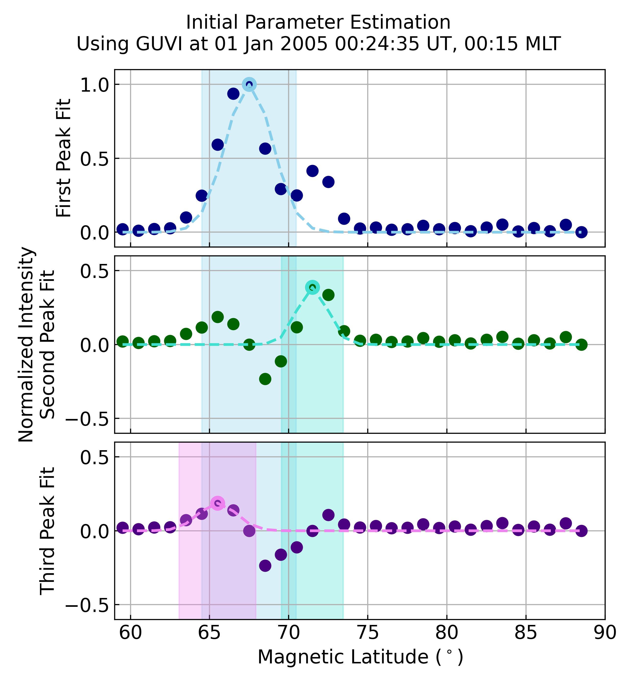
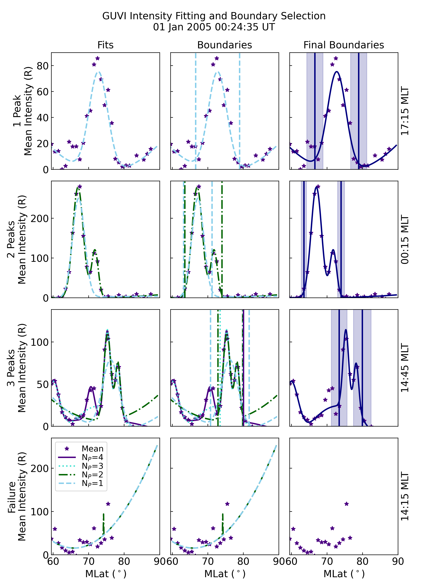

.. _exfitting:

Using the Fitting Functions
===========================

The functions provided in the fitting sub-module can be used for more than
just identifying auroral boundaries.  The examples here can help you understand
the details and purpose behind some of the supporting functions.

Find the Maximum Number of Gaussian Peaks
-----------------------------------------

:py:func:`pyIntensityFeatures.proc.fitting.get_fitting_params` finds the
quadratic and Gaussian parameters for a single or multi-peaked Gaussian with
a quadratic background (see
:py:func:`pyIntensityFeatures.utils.distributions.mult_gauss_quad`). One aspect
of this function is that it adaptively determines the highest number of Gaussian
peaks should be fit, up to a user specified maximum. This example shows how
this peak identification process works using the TIMED-GUVI data obtained
from Example :ref:`expysat`.  For this example we'll create a plot that shows
how each subsequent Gaussian peak and the initial fitting parameters for that
peak are determined.

::

   import matplotlib.pyplot as plt
   import numpy as np

   from pyIntensityFeatures.utils import coords
   from pyIntensityFeatures.utils import distribution
   from pyIntensityFeatures.proc import fitting

   # Initalize the figure
   fig = plt.figure(figsize=(6.5, 7.1))
   axes = [fig.add_subplot(3, 1, 1 + i) for i in range(3)]

   # Set axis formatting parameters
   ylabel = ['First Peak Fit', 'Normalized Intensity\nSecond Peak Fit',
             'Third Peak Fit']
   colors = ['navy', 'skyblue', 'darkgreen', 'turquoise', 'indigo', 'violet']
   yrange = np.array([-.1, 1.1])

   # Get the latitudes with data for the desired UT and MLT
   iut = 0  # This will use the Universal Time 2005-01-01T00:24:35.572131
   imlt = 0  # This will use the MLT 00:15
   mean_int = guvi_alb.boundaries['mean_intensity'][iut].values
   ilat = np.array([i for i, mint in enumerate(mean_int[:, imlt])
                    if np.isfinite(mint)])
   mlat = guvi_alb.boundaries['mean_intensity'].lat.values[ilat]
   max_peaks = 4  # Set the maximum possible number of Gaussian peaks to four

The above steps gather the information from
:py:class:`~pyIntensityFeatures._main.AuroralBounds` that can be used to run
:py:func:`~pyIntensityFeatures.proc.fitting.get_fitting_params`. Next, we go
into the portions of
:py:func:`~pyIntensityFeatures.proc.fitting.get_fitting_params` that identify
valid peaks in the intensity. For this example, we know that there will be two
peaks, so we only need to plot three axis and setting `max_peaks` to anything
greater than 2 will work.

::

   # Normalize the intensity
    norm_intensity = (mean_int[ilat, imlt] - mean_int[ilat, imlt].min()) / (
        mean_int[ilat, imlt].max() - mean_int[ilat, imlt].min())

    # Get the first peak and width
    ipeaks = [norm_intensity.argmax()]
    peak_sigmas = fitting.estimate_peak_widths(norm_intensity, mlat, ipeaks,
                                               [norm_intensity[ipeaks[0]]])

Now cycle through all of the axis and show how each peak and it's Gaussian
parameters are identified.  It starts by using the normalised intensity,
`norm_intensity`, as the center of a single-peaked Gaussian.  Next, the
single-peak Gaussian fit is subtracted from the normalized intensity so that
a new maximum can be identified and fit.  This process continues until the next
identified maximum falls within two standard deviations of a previously
identified maximum.  This prevents inflection points created from the
subtraction process from being identified as separate peaks.

::

   for i, ax in enumerate(axes):
       # Get the single-peaked Gaussian fit for the normalized maximum
       prior_gauss = distributions.gauss(mlat, norm_intensity[ipeaks[-1]],
                                         mlat[ipeaks[-1]], peak_sigmas[-1],
                                         0.0)

       # Plot the normalized intensity, peak value, and Gaussian fit
       ax.plot(mlat, norm_intensity, 'o', color=colors[i * 2], ms=8)
       ax.plot(mlat[ipeaks[-1]], norm_intensity[ipeaks[-1]], 'o',
               markeredgecolor=colors[i * 2 + 1], ms=8,
               markerfacecolor='none', markeredgewidth=3)
       ax.plot(mlat, prior_gauss, '--', lw=2, color=colors[i * 2 + 1])

       # Get the subplot spec to determine formatting
       spec = ax.get_subplotspec()

       # Add patches to show the area within two standard deviations from
       # each identified maximum
       for ip, pind in enumerate(ipeaks):
           patch = mpl.patches.Rectangle(
               (mlat[pind] - 2.0 * peak_sigmas[ip], yrange[0]),
               4.0 * peak_sigmas[ip], yrange[1] - yrange[0],
               color=colors[ip * 2 + 1], alpha=0.3, zorder=ip)
           ax.add_patch(patch)

       # Format the axis with labels and grids for easy reference across
       # panels
       ax.set_ylabel(ylabel[i])
       ax.set_xlim(59, 90)
       ax.set_ylim(yrange)
       ax.grid()

       if spec.is_last_row():
           ax.set_xlabel(r'Magnetic Latitude ($^\circ$)')
       else:
           ax.xaxis.set_major_formatter(mpl.ticker.FormatStrFormatter(''))

       # Cycle to the next peak by subtracting the fit from the normalised
       # intensity. Then find the Gaussian parameters for the next peak.
       norm_intensity -= prior_gauss
       ipeaks.append(norm_intensity.argmax())
       peak_sigmas.extend(fitting.estimate_peak_widths(
           norm_intensity, mlat, [ipeaks[-1]], [norm_intensity[ipeaks[-1]]]))

       # Adjust the y-range for the second and third panels
       if i == 0:
           yrange -= 0.5

   # Adjust the figure boundaries and format the title
   fig.subplots_adjust(left=.18, right=.95, hspace=.05, top=.9)
   sweep_time = coords.as_datetime(guvi_alb.boundaries[
       'mean_intensity'].sweep_start.values[iut])
   mlt = guvi_alb.boundaries['mean_intensity'].mlt.values[imlt]
   fig.suptitle(
       ''.join(["Initial Parameter Estimation\nUsing GUVI at ",
                sweep_time.strftime('%d %b %Y %H:%M:%S UT,'),
                " {:02}:{:02} MLT".format(
                    int(np.floor(mlt)),
                    int(np.floor((mlt - np.floor(mlt)) * 60)))]),
       fontsize='medium')

This figure shows the normalised or normalised and subtracted intensity in dark
circles, the peak as a light ring around the circle, the full-width at
half-maximum distance from the peak as a light coloured patch of the same colour
as the corresponding peak, and the single-peaked Gaussian fit for each peak
as a light-coloured, dashed line.  The first (blue) and second (green) peaks
are identified as significant due to their separation.  The third peak (purple)
is rejected, as it falls within two standard deviations of the first peak.

The :py:func:`~pyIntensityFeatures.proc.fitting.get_fitting_params` function
will return two peaks that correspond to the first two peaks in the `ipeaks`
list (which will be two items longer) that was created during the plot creation.

::

   params, npeaks = fitting.get_fitting_params(
       guvi_alb.boundaries['mean_intensity'].lat.values, ilat, imlt,
       guvi_alb.boundaries['mean_intensity'].values[iut], num_gauss=max_peaks)

   print(npeaks, ipeaks)  # Yields: [8, 12] [8, 12, 6, 13]

   
Find the Boundaries for Different Gaussian Fits
-----------------------------------------------

:py:func:`pyIntensityFeatures.proc.fitting.get_gaussian_func_fit` finds the
quadratic and Gaussian parameters for a single and multi-peaked Gaussian with
a quadratic background (see
:py:func:`pyIntensityFeatures.utils.distributions.mult_gauss_quad`) and returns
statistics that can be used to evaluate each fit. This example contiues from
the prior example, using the same slice of TIMED-GUVI data. For this example
we'll create a plot that shows the final Gaussian fits, boundaries, and final
boundaries at four different magnetic local times (MLTs).

::

   from pyIntensityFeatures.proc import boundaries

   # Reset the MLT indices
   imlts = [34, 0, 29, 28]

   # Initalize a new figure
   nrows = len(imlts)
   row_labels = ['1 Peak', '2 Peaks', '3 Peaks', 'Failure']
   ax_titles = ['Fits', 'Boundaries', 'Final Boundaries']
   lines = ["-", "--", "-.", ":", "-"]
   fig = plt.figure(figsize=(8.5, 2.9 * nrows))
   axes = {imlt: [fig.add_subplot(nrows, 3, 1 + i + j * (nrows - 1))
                  for i in range(3)] for j, imlt in enumerate(imlts)}

   # Get the base data variables
   min_num = 3  # Minimum number of samples to contribute to the mean intensity
   min_intensity = 0.0  # Minimum intensity magnitude in Rayleigh
   num_int = guvi_alb.boundaries['num_intensity'][iut].values
   uncert_int = 1.0 / guvi_alb.boundaries['std_intensity'][iut].values
   po_params = guvi_alb.boundaries['po_params'][iut].values
   eq_params = guvi_alb.boundaries['eq_params'][iut].values
   plot_mlat = np.arange(mlat[0], mlat[-1] + .1, .1)
   mlt = guvi_alb.boundaries['mlt'].values
   mlat = guvi_alb.boundaries['lat'].values

   # Initalize the variables used to store the boundaries
   params = dict()
   covar = dict()
   rvalue = dict()
   pvalue = dict()
   npeaks = dict()
   eq_bounds = np.full(shape=(len(imlts), max_peaks), fill_value=np.nan)
   po_bounds = np.full(shape=(len(imlts), max_peaks), fill_value=np.nan)

   # Find the potential Gaussian fits and boundaries for each MLT
   for ng in np.arange(1, max_peaks + 1, 1):
       # Get the single, double, or triple Gaussian fits at each MLT
       params[ng], covar[ng], rvalue[ng], pvalue[ng], npeaks[
           ng] = fitting.get_gaussian_func_fit(
               mlat, mlt, mean_int,
               guvi_alb.boundaries['std_intensity'][iut].values, num_int,
               num_gauss=ng, min_num=min_num, min_intensity=min_intensity,
               min_lat_perc=1.0)

       # Locate the boundaries at each MLT
       for i, imlt in enumerate(imlts):
           # Get the boundaries for each fit type
           for ng in params.keys():
               if ng == 2 and np.shape(params[ng][imlt]) != (9,):
                   good_shape = False
               else:
                   good_shape = True

               if good_shape and covar[ng][imlt] is not None:
                   # Get the boundaries
                   method = "single" if ng == 0 else "best"
                   bounds, good_ng = boundaries.get_eval_boundaries(
                       params[ng][imlt], covar[ng][imlt], rvalue[ng][imlt],
                       pvalue[ng][imlt], npeaks[ng][imlt], 59, 90, method)

                   eq_bounds[i, ng - 1] = bounds[0]
                   po_bounds[i, ng - 1] = bounds[1]

This has set up a figure that will have all the Gaussian fits that
:py:func:`~pyIntensityFeatures.proc.fitting.get_fitting_params` identified as
potentially valid fits in the left column, the valid boundaries for each fit
on top of the fits in the second column, and the final selected boundaries and
the fit they came from in the third column.

::

   # Cycle through each row, making the desired plots
   min_lat = []
   for i, imlt in enumerate(imlts):
       # Get the data for this MLT index
       max_int = []
       ilat = np.where(np.isfinite(mean_int[:, imlt])
                       & (num_int[:, imlt] >= min_num)
                       & (mean_int[:, imlt] >= min_intensity))[0]
       min_lat.append(mlat[ilat[0]])
       ipo = np.where(np.isfinite(po_params[imlt]))[0]
       ieq = np.where(np.isfinite(eq_params[imlt]))[0]

       # Get the accepted fits
       gauss_fits = list()
       if len(ipo) > 0:
           gauss_fits.append(distributions.mult_gauss_quad(
               plot_mlat, po_params[imlt][ipo]))

       if len(ieq) > 0 and (len(ipo) != len(ieq) or not np.all(
               po_params[imlt][ipo] == eq_params[imlt][ieq])):
           gauss_fits.append(distributions.mult_gauss_quad(
               plot_mlat, eq_params[imlt][ieq]))

       # Get the potential fitting parameters
       params, ipeaks = fitting.get_fitting_params(mlat, ilat, imlt, mean_int,
                                                   num_gauss=max_peaks)

       # Get the fit for each valid number of peaks
       valid_fits = list()
       lsq_args = (mlat[ilat], mean_int[ilat, imlt], uncert_int[ilat, imlt])
       while len(ipeaks) > 0:
           lsq_res = leastsq(fitting.gauss_quad_err, params,
                             args=lsq_args, full_output=True)

           # Evaluate the least squares output and save the results
           if lsq_res[-1] in [1, 2, 3, 4]:
               valid_fits.append(distributions.mult_gauss_quad(
                   plot_mlat, lsq_res[0]))
           else:
               valid_fits.append(np.full(shape=plot_mlat.shape,
                                         fill_value=np.nan))

           # Remove the highest order peak and its fitting parameters
           ipeaks.pop()
           params = list(np.array(params)[:-3])

       # Cycle through the columns
       for j, ax in enumerate(axes[imlt]):
           # Plot the mean intensity
           ax.plot(mlat, mean_int[:, imlt], '*',
                   color=colors[4], label='Mean')

           if j < 2:
               # Plot all potential fits
               max_fit = len(valid_fits)
               for g, gfit in enumerate(valid_fits):
                   ax.plot(plot_mlat, gfit, lines[max_fit - g],
                           color=colors[max_fit - g], lw=2,
                           label="N$_P$={:d}".format(max_fit - g))
           else:
               # Plot the accepted distribution(s)
               for g, gfit in enumerate(gauss_fits):
                   ax.plot(plot_mlat, gfit, lines[g], color=colors[g], lw=2)

           # Get the subplot spec to determine formatting
           spec = ax.get_subplotspec()

           if spec.is_first_col():
               ax.set_ylabel("{:s}\nMean Intensity (R)".format(row_labels[i]))

               if spec.is_last_row():
                   ax.legend(fontsize='small')
           else:
               ax.yaxis.set_major_formatter(mpl.ticker.FormatStrFormatter(''))

               if spec.is_last_col():
                   ax.yaxis.set_label_position("right")
                   hr = int(np.floor(mlt[imlt]))
                   mn = int(np.floor(60 * (mlt[imlt] - hr)))
                   ax.set_ylabel("{:02d}:{:02d} MLT".format(hr, mn))

           if spec.is_first_row():
               ax.set_title(ax_titles[j], fontsize='medium')

           if spec.is_last_row():
               ax.set_xlabel(r'MLat ($^\circ$)')
           else:
               ax.xaxis.set_major_formatter(mpl.ticker.FormatStrFormatter(''))

           ax.set_xlim(min(min_lat), 90)
           ymin, ymax = ax.get_ylim()
           max_int.append(ymax)
           ax.xaxis.set_major_locator(mpl.ticker.MultipleLocator(10))

       # Once all axis have been plotted for this row, adjust the y-axis range
       ymax = max(max_int)
       for j, ax in enumerate(axes[imlt]):
           ax.set_ylim(0, ymax)

           # Plot the boundaries
           if j == 1:
               for ibnd, eqb in enumerate(eq_bounds[i]):
                   if ibnd < len(valid_fits):
                       ax.plot([eqb, eqb], [0, ymax], lines[ibnd + 1],
                               color=colors[ibnd + 1], lw=2)
                       ax.plot([po_bounds[i, ibnd], po_bounds[i, ibnd]],
                               [0, ymax], lines[ibnd + 1],
                               color=colors[ibnd + 1], lw=2)
           elif j == 2:
               pbnd = guvi_alb.boundaries['po_bounds'].values[iut, imlt]
               ebnd = guvi_alb.boundaries['eq_bounds'].values[iut, imlt]
               ax.plot([pbnd, pbnd], [0, ymax], '-', color=colors[0], lw=2)
               ax.plot([ebnd, ebnd], [0, ymax], '-', color=colors[0], lw=2)

               # Also plot the uncertainty
               patch = mpl.patches.Rectangle(
                   (pbnd - guvi_alb.boundaries['po_uncert'].values[iut, imlt],
                    0),
                   2.0 * guvi_alb.boundaries['po_uncert'].values[iut, imlt],
                   ymax, color=colors[0], alpha=.2)
               ax.add_patch(patch)
               patch = mpl.patches.Rectangle(
                   (ebnd - guvi_alb.boundaries['eq_uncert'].values[iut, imlt],
                    0),
                   2.0 * guvi_alb.boundaries['eq_uncert'].values[iut, imlt],
                   ymax, color=colors[0], alpha=.2)
               ax.add_patch(patch)

   # Finish formatting the figure
   fig.suptitle('GUVI Intensity Fitting and Boundary Selection\n{:}'.format(
       sweep_time.strftime('%d %b %Y %H:%M:%S UT')), fontsize='medium')
   fig.subplots_adjust(left=.12, right=.93, hspace=.1, wspace=.1, top=.91,
                       bottom=.05)

This figure shows a simple example of an intensity profile that is
well-described by a single-peaked Gaussian in the top row. The adaptive peak
identification correctly identifies the scatter (with mean intensity levels near
and below 20 R) as insignificant.  The changes in the background level is
captured by the quadratic function.

The second row shows an intensity profile that is best represented by two
Gaussian peaks. The single-peaked Gaussian results in a similar boundary
location at the equatorward edge, but capturing the second peak moves the
poleward boundary by several degrees.

The third row shows a complex intensity profile that can be fit by a four-peaked
Gaussian function. The three-peaked Gaussian is used to find the boundaries, as
the four-peaked function's equatorward boundary falls outside of the allowable
latitude range. This highlights the dangers of over-fitting, and is why a
maximum of three-peaked fits is recommended in the processing.

The final row shows a period of time when a good fit could not be obtained and
no boundaries were selected, as a result.
