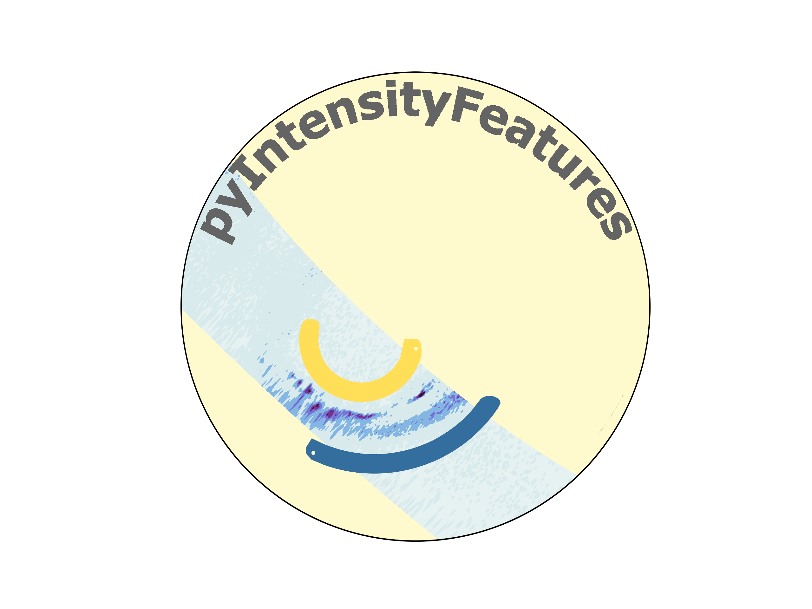

Overview
========

pyIntensityFeatures is a package designed to identify intensity features in
imager data.  Currently, support is provided for the identificaiton of auroral
luminosity boundaries at the poleward and equatorward edges of the auroral oval
in various satellite imager obsrevations.

